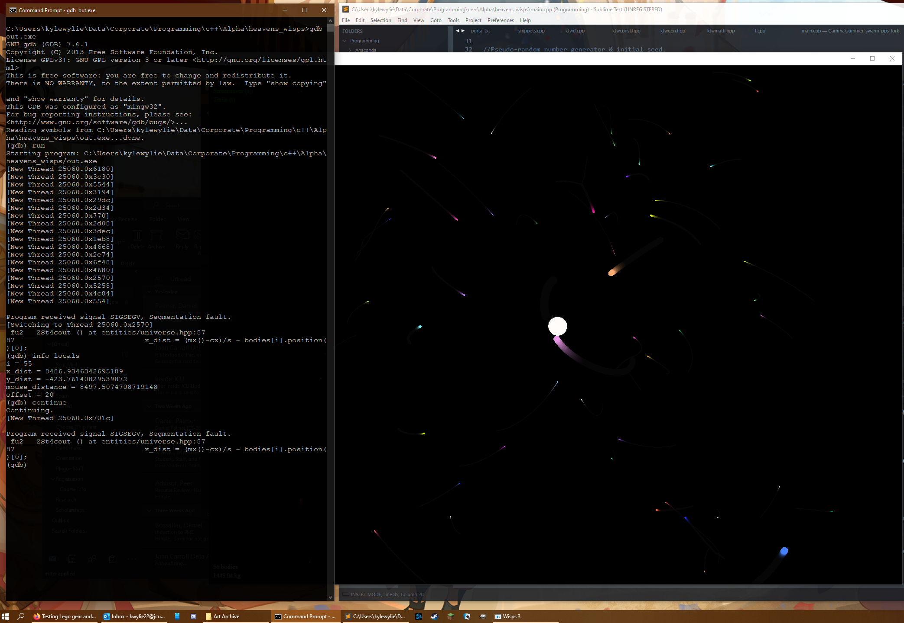

# N-body physics simulation

Implements a gravitational simulation where bodies are attracted towards each other according to their mass, and physically correctly transfer momentum upon inelastic collisions. 

